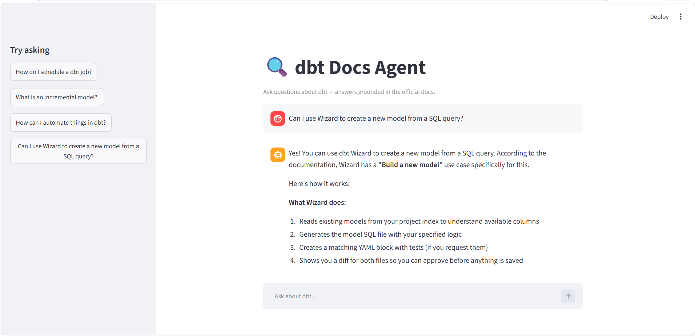

# dbt Docs Agent

An AI agent that answers questions about [dbt](https://www.getdbt.com/) by
searching the official documentation and grounding every answer in the source.

Built during the [AI Hero 7-day course](https://aishippinglabs.com/courses/aihero)
(DataTalks.Club) over the `dbt-labs/docs.getdbt.com` repository.

## What it does

Ask a natural-language question about dbt — "How do I schedule a job?", "What's
the difference between a snapshot and an incremental model?" — and the agent
searches ~8,000 documentation chunks, decides what to look up (sometimes running
several searches), and answers with citations to the source files.

## Demo





## How it works

A five-stage pipeline:

1. **Ingest** — download the dbt docs repo, parse frontmatter from each `.md`/`.mdx` file
2. **Chunk** — split on markdown headers (`##`/`###`), keeping code blocks intact
3. **Search** — lexical (minsearch) + vector (sentence-transformers) + hybrid merge
4. **Agent** — Claude with a `text_search` tool, deciding when and how often to search
5. **Evaluate** — LLM-generated test questions scored by an LLM judge

## Tech

- **Search:** minsearch (lexical), sentence-transformers `multi-qa-distilbert-cos-v1` (vector)
- **Agent:** Anthropic Claude with tool use
- **UI:** Streamlit
- **Corpus:** dbt documentation (`current` branch)

## Run it locally

```bash
# clone and enter
git clone https://github.com/YOUR_USERNAME/dbt-docs-agent.git
cd dbt-docs-agent

# install
pip install -r requirements.txt

# add your Anthropic API key
cp .env.example .env      # then paste your key into .env

# build the corpus (ingest + chunk), then run the app
python pipeline.py        # or run the pipeline notebook
streamlit run app.py
```

Opens at http://localhost:8501.

## Evaluation results

The agent was evaluated on LLM-generated questions plus hand-picked hard cases,
scored 1–5 by an LLM judge on groundedness, relevance, citation, and completeness.

| Metric | Sliding-window chunking | Header-first chunking |
|--------|------------------------|-----------------------|
| overall | 3.64 | **3.81** |
| relevance | 4.04 | 4.42 |
| completeness | 3.48 | 3.81 |

**Key finding:** a low score on one hard question ("create a model from a SQL
query") traced back to a *chunking* decision three stages upstream — sliding
windows had smeared the answer across near-duplicate fragments. Switching to
header-based chunking isolated the answer and raised the overall score. This is
why evaluation matters: it points at root causes, not just symptoms.

## Project structure

```
pipeline.py / pipeline.ipynb   full pipeline: ingest -> chunk -> index -> agent -> eval
search.py                      lexical + vector + hybrid search
agent.py                       the tool-using agent
app.py                         Streamlit chat UI
requirements.txt               dependencies
```

## Credits

Course by [Alexey Grigorev](https://alexeygrigorev.com/) / DataTalks.Club.